# mermaid-playground.nvim

Preview **Mermaid** diagrams from Markdown or standalone Mermaid files — _instantly_ — in your browser.

- **Markdown**: Uses the **fenced \` ```mermaid \`** block **under your cursor**
- **Mermaid files**: Supports standalone **`.mmd`** and **`.mermaid`** files (entire file content)
- Writes the diagram to **`~/.config/mermaid-playground/diagram.mmd`** (global workspace)
- Serves a minimal, beautiful **live preview** via [`live-server.nvim`](https://github.com/barrett-ruth/live-server.nvim)
- **Auto-refreshes** on edit (debounced) and **reuses the same tab** (no tab spam)
- Export SVG, zoom, fit-to-width/height, dark/light theme, nice error chip (no “boom” screens)

---
## Demo

 

---

## ✨ Quick start (30 seconds)

1) **Prereqs**

```bash
# Node tool used by live-server.nvim
npm i -g live-server
```

2) **Install (lazy.nvim)**

```lua
{
  "selimacerbas/mermaid-playground.nvim",
  dependencies = { "barrett-ruth/live-server.nvim" },
  config = function()
    require("mermaid_playground").setup({
      -- all optional; sane defaults shown
      workspace_dir = nil,                -- defaults to: $XDG_CONFIG_HOME/mermaid-playground
      index_name    = "index.html",
      diagram_name  = "diagram.mmd",
      overwrite_index_on_start = false,   -- don't clobber your customized index.html
      auto_refresh  = true,
      auto_refresh_events = { "InsertLeave", "TextChanged", "TextChangedI", "BufWritePost" },
      debounce_ms   = 450,
      notify_on_refresh = false,
    })
  end,
}
```

(For **packer.nvim**, adapt as usual.)

3) **Use it**

- **For Markdown files**: Put your cursor **inside a fenced Mermaid block**:

  ```markdown
  ```mermaid
  graph TD
    A[Start] --> B{Is it good?}
    B -->|Yes| C[Ship it]
    B -->|No| D[Fix it]
  ```
  ```

- **For standalone Mermaid files**: Open any **`.mmd`** or **`.mermaid`** file with your Mermaid diagram content:

  ```mermaid
  graph TD
    A[Start] --> B{Is it good?}
    B -->|Yes| C[Ship it]
    B -->|No| D[Fix it]
  ```

  > **Note**: For `.mmd` files, you may need to set the filetype manually with `:set ft=mermaid` or configure filetype detection in your Neovim config.

- Start preview: **`<leader>mps`** (works in both Markdown and Mermaid files)  
- Edit as you like; leaving insert or writing the buffer will **auto-refresh**.  
- Force re-render: **`<leader>mpr`**  
- Stop server: **`<leader>mpS`**

> The first start opens your browser once. Subsequent refreshes **reuse the same tab**.

---

## 📁 File Type Support

This plugin supports:
- **Markdown files** with ```` ```mermaid ```` fenced code blocks
- **Mermaid files** with `.mermaid` extension (usually auto-detected by Neovim)
- **Mermaid files** with `.mmd` extension

For `.mmd` files, you may want to add filetype detection to your Neovim configuration:

```lua
-- In your init.lua or after/ftdetect/mermaid.lua
vim.filetype.add({
  extension = {
    mmd = "mermaid",
  },
})
```

---

## ⌨️ Keymaps & Commands

| Action     | Keymap         | Command                  |
|------------|----------------|--------------------------|
| Start      | `<leader>mps`  | `:MermaidPreviewStart`   |
| Refresh    | `<leader>mpr`  | `:MermaidPreviewRefresh` |
| Stop       | `<leader>mpS`  | `:MermaidPreviewStop`    |

> Keymaps are defined under the `mp` group. Feel free to remap in your config.

---

## 🗂 Workspace & files

- By default, files live in **`~/.config/mermaid-playground/`** (or `$XDG_CONFIG_HOME/mermaid-playground`):
  - `index.html` – the preview UI (copied from the plugin on first run)
  - `diagram.mmd` – the currently previewed diagram (rewritten on refresh)

Want a project-local workspace instead? In `setup()`:

```lua
require("mermaid_playground").setup({
  workspace_dir = ".mermaid-live",       -- use a folder in the repo
  overwrite_index_on_start = true,        -- keep the html in sync with plugin
})
```

---

## 🧭 Browser UI

- **Zoom** `- / 100% / +`
- **Fit width / Fit height**
- **Reload** (force refetch of `diagram.mmd`)
- **Export SVG**
- **Theme** toggle (Dark/Light)

**Error handling:** If your diagram is temporarily invalid, the last good render remains visible and a small chip appears in the corner (no giant “boom” error). It clears on the next valid render.

**Icon packs:** The preview auto-detects [Iconify](https://iconify.design/) packs referenced in your diagram (e.g. `logos:google-cloud`). They are loaded on demand.

---

## ⚙️ Configuration reference

```lua
require("mermaid_playground").setup({
  workspace_dir = nil,                    -- default: $XDG_CONFIG_HOME/mermaid-playground
  index_name    = "index.html",
  diagram_name  = "diagram.mmd",
  overwrite_index_on_start = false,       -- copy plugin's assets/index.html on every start if true

  auto_refresh  = true,                   -- enable buffer-local auto update
  auto_refresh_events = {                 -- which events trigger refresh (debounced)
    "InsertLeave", "TextChanged", "TextChangedI", "BufWritePost"
  },
  debounce_ms   = 450,                    -- debounce for auto_refresh events
  notify_on_refresh = false,              -- small :notify on refresh
})
```

> Uses Tree-sitter to locate the fenced block under the cursor (with a regex fallback). Any fenced block labelled `mermaid` is supported. For standalone `.mmd` and `.mermaid` files, the entire file content is used.

---

## 🧩 Dependencies

- **Neovim** 0.9+ recommended
- **[live-server.nvim](https://github.com/barrett-ruth/live-server.nvim)** and **`live-server`** (npm global)
- **Tree-sitter** with the **Markdown** parser installed (for best results)

`live-server.nvim` defaults to port **5555**. If something else uses that port:

```lua
require("live-server").setup({
  args = { "--port=7777" },
})
```

The preview HTML doesn’t hardcode a URL; it works with whatever port `live-server.nvim` chooses.

---

## 🛠 Troubleshooting

**Browser shows “Cannot GET /index.html”.**  
Make sure the server is started **in the same directory** as the workspace. This plugin does that automatically; if you customized `workspace_dir`, double-check the path exists and is writable.

**No diagram updates.**  
- Ensure your cursor was inside a ` ```mermaid ` block when you started.
- Check `auto_refresh_events` and `debounce_ms`. Try a manual refresh with `<leader>mpr`.

**Still seeing “boom” error graphics** under the preview.  
Replace your `index.html` with the one shipped in the plugin (`assets/index.html`) or set `overwrite_index_on_start = true` once to copy the latest.

**Port already in use / multiple servers.**  
Use `<leader>mpS` to stop, change the port in `live-server.nvim`, then `<leader>mps` again.

**Windows paths.**  
The global workspace resolves via `vim.loop.os_homedir()`; if you prefer a custom directory, set `workspace_dir` explicitly.

---

## 🧪 Example diagram with Iconify

```mermaid
architecture-beta
group vpc(cloud)[gcp]
group subnet(subnet)[subnet] in vpc

service db(database)[mariadb] in subnet

%% Iconify packs are auto-detected: logos:google-cloud
service cool(logos:google-cloud)[cool]
```



---

## 📦 Project structure (plugin)

```
mermaid-playground.nvim/
├─ plugin/mermaid-playground.lua         -- commands + keymaps (mps/mpr/mpS)
├─ lua/mermaid_playground/
│  ├─ init.lua                           -- main logic (workspace, refresh, server)
│  ├─ util.lua                           -- tiny fs helpers
│  └─ ts.lua                             -- Tree-sitter extractor + fallback
└─ assets/
   └─ index.html                         -- minimal preview app (served by live-server)
```

---

## 🙌 Thanks

- [Mermaid](https://mermaid.js.org/) for the diagram engine  
- [Iconify](https://iconify.design/) packs for easy service logos  
- [live-server.nvim](https://github.com/barrett-ruth/live-server.nvim) for the lightweight dev server

PRs and ideas welcome!

